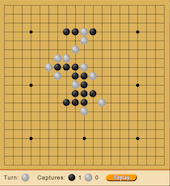

# School Projects
Some of my school projects at Ecole 42

## Gomoku (C++)
Gomoku game (Ninuki-renju /Pente variants) with an AI (minMax AlphaBeta algorithm)
Goal: align 5 stones of the same color. Capture is possible (surround 2 pieces)
#### Render:


## Libft (C)
Libc rewritten library coupled with my own library of:
- linked list simple and circular (with merge sort)
- binary trees (with red & black balance)
- hashtable dictionary

## Printf (C)
In progress

## Linear Regression (Python)
Introduction to machine learning.
Program that predicts the price of a car by using a linear function train with a gradient descent algorithm
#### How it works:
```
python linear_reg.py
```
(to load the data in Datasets directory)

#### Options:
- g: to draw a graph representing the data set and the linear regression
- i: to set the number of iterations (default: 1000)
- s: to set the learning rate (default: 0.1)
- p: to print all theta values into a file
- e: to print estimation errors
```
python main.py
```
**type de number of miles the car has travelled**

## Npuzzle (Javascript / Express)
N-puzzle game solver using the Astar search algorithm.

### Installation
```
npm install
```
### Launch it  on terminal
Create a npuzzle map file
```
python doc/npuzzle-gen.py -s -i 150 4 > test.txt
```
#### Options:
- s: solvable
- u: unsolvable
- i [nb]: number of iterations
- last option: size of the puzzle

Launch the solver on the generated npuzzle map file
```
node ./bin/main.js test.txt  [-m -h -e] [-g -u]
```
#### Options:
- m: manhattan heuristic
- h: hamming heuristic
- e: euclidian heuristic
- g: sets greedy (heuristics = 0 => fast)
- u: sets uniform cost (djiskstra => long)

### Launch it on browser:
This command launches an express server
```
npm start
```
Then go to [localhost:4242](http://localhost:4242)

## Taskmaster (Python)
Fully-fledged job control daemon similar to supervisor

### Installation
```
pip install pyyaml
```
configs of the program could be changed in config/default_config.yml

# Other Projects

## Study Heroes (Symfony2, Angular, Ionic)
Mobile application that use Gamification and science to make learning fun and effective for students.
[Study Heroes](http://studyheroes.fr/)

## Shorei Kan Europe (Symfony2, React Redux)
(in progress)
Website with an admin panel, a blog, a newsletter, google map integration etc.
[Shorei Kan Europe](http://shorei-kan-europe.com/)
